# The magick package: Advanced Image-Processing in R

The [magick](https://cran.r-project.org/package=magick) package provide
a modern and simple toolkit for image processing in R. It wraps the
[ImageMagick STL](https://imagemagick.org/Magick++/STL.html) which is
the most comprehensive open-source image processing library available
today.

The ImageMagick library has an overwhelming amount of functionality.
Magick exposes a decent subset of it, but it is impossible to document
everything in detail. This article introduces some basic concepts and
examples to get started.

## Installing `magick`

On Windows or macOS the package is most easily installed via CRAN.

``` r

install.packages("magick")
```

The binary CRAN packages work out of the box and have most important
features enabled. Use `magick_config` to see which features and formats
are supported by your version of ImageMagick.

``` r

library(magick)
```

    ## Linking to ImageMagick 6.9.12.98
    ## Enabled features: fontconfig, freetype, fftw, heic, lcms, pango, raw, webp, x11
    ## Disabled features: cairo, ghostscript, rsvg

    ## Using 4 threads

``` r

str(magick::magick_config())
```

    ## List of 24
    ##  $ version           :Class 'numeric_version'  hidden list of 1
    ##   ..$ : int [1:4] 6 9 12 98
    ##  $ modules           : logi TRUE
    ##  $ cairo             : logi FALSE
    ##  $ fontconfig        : logi TRUE
    ##  $ freetype          : logi TRUE
    ##  $ fftw              : logi TRUE
    ##  $ ghostscript       : logi FALSE
    ##  $ heic              : logi TRUE
    ##  $ jpeg              : logi TRUE
    ##  $ lcms              : logi TRUE
    ##  $ libopenjp2        : logi TRUE
    ##  $ lzma              : logi TRUE
    ##  $ pangocairo        : logi TRUE
    ##  $ pango             : logi TRUE
    ##  $ png               : logi TRUE
    ##  $ raw               : logi TRUE
    ##  $ rsvg              : logi FALSE
    ##  $ tiff              : logi TRUE
    ##  $ webp              : logi TRUE
    ##  $ wmf               : logi TRUE
    ##  $ x11               : logi TRUE
    ##  $ xml               : logi TRUE
    ##  $ zero-configuration: logi FALSE
    ##  $ threads           : int 4

### Build from source

On Linux you need to install the ImageMagick++ library: on Debian/Ubuntu
this is called
[libmagick++-dev](https://packages.debian.org/testing/libmagick++-dev):

    sudo apt-get install libmagick++-dev

On Fedora or CentOS/RHEL we need
[ImageMagick-c++-devel](https://src.fedoraproject.org/rpms/ImageMagick):

    sudo yum install ImageMagick-c++-devel

To install from source on macOS you need either `imagemagick@6` or
`imagemagick` from homebrew.

    brew install imagemagick@6

Unfortunately the current `imagemagick@6` configuration on homebrew
disables a bunch of features, including librsvg and fontconfig.
Therefore the quality of fonts and svg rendering might be suboptimal.
The is not a problem for the CRAN binary package.

## Image IO

What makes magick so magical is that it automatically converts and
renders all common image formats. ImageMagick supports dozens of formats
and automatically detects the type. Use
[`magick::magick_config()`](https://docs.ropensci.org/magick/reference/config.md)
to list the formats that your version of ImageMagick supports.

### Read and write

Images can be read directly from a file path, URL, or raw vector with
image data with `image_read`. The `image_info` function shows some meta
data about the image, similar to the imagemagick `identify` command line
utility.

``` r

library(magick)
tiger <- image_read_svg('http://jeroen.github.io/images/tiger.svg', width = 350)
print(tiger)
```

    ##   format width height colorspace matte filesize density
    ## 1    PNG   350    350       sRGB  TRUE        0   72x72


We use `image_write` to export an image in any format to a file on disk,
or in memory if `path = NULL`.

``` r

# Render svg to png bitmap
image_write(tiger, path = "tiger.png", format = "png")
```

If `path` is a filename, `image_write` returns `path` on success such
that the result can be piped into function taking a file path.

### Converting formats

Magick keeps the image in memory in its original format. Specify the
`format` parameter `image_write` to convert to another format. You can
also internally convert the image to another format earlier, before
applying transformations. This can be useful if your original format is
lossy.

``` r

tiger_png <- image_convert(tiger, "png")
image_info(tiger_png)
```

    ##   format width height colorspace matte filesize density
    ## 1    PNG   350    350       sRGB  TRUE        0   72x72

Note that size is currently 0 because ImageMagick is lazy (in the good
sense) and does not render until it has to.

### Preview

IDE’s with a built-in web browser (such as RStudio) automatically
display magick images in the viewer. This results in a neat interactive
image editing environment.


Alternatively, on Linux you can use `image_display` to preview the image
in an X11 window. Finally `image_browse` opens the image in your
system’s default application for a given type.

``` r

# X11 only
image_display(tiger)

# System dependent
image_browse(tiger)
```

Another method is converting the image to a raster object and plot it on
R’s graphics display. However this is very slow and only useful in
combination with other plotting functionality. See
[\#raster](#raster-images) below.

## Transformations

The best way to get a sense of available transformations is walk through
the examples in the `?transformations` help page in RStudio. Below a few
examples to get a sense of what is possible.

### Cut and edit

Several of the transformation functions take an `geometry` parameter
which requires a special syntax of the form `AxB+C+D` where each element
is optional. Some examples:

- `image_crop(image, "100x150+50")`: *crop out `width:100px` and
  `height:150px` starting `+50px` from the left*
- `image_scale(image, "200")`: *resize proportionally to width: `200px`*
- `image_scale(image, "x200")`: *resize proportionally to height:
  `200px`*
- `image_fill(image, "blue", "+100+200")`: *flood fill with blue
  starting at the point at `x:100, y:200`*
- `image_border(frink, "red", "20x10")`: *adds a border of 20px
  left+right and 10px top+bottom*

The full syntax is specified in the
[Magick::Geometry](https://imagemagick.org/Magick++/Geometry.html)
documentation.

``` r

# Example image
frink <- image_read("https://jeroen.github.io/images/frink.png")
```

``` r

print(frink)
```

    ##   format width height colorspace matte filesize density
    ## 1    PNG   220    445       sRGB  TRUE    73494   72x72


``` r

# Add 20px left/right and 10px top/bottom
image_border(image_background(frink, "hotpink"), "#000080", "20x10")
```


``` r

# Trim margins
image_trim(frink)
```


``` r

# Passport pica
image_crop(frink, "100x150+50")
```


``` r

# Resize
image_scale(frink, "300") # width: 300px
```


``` r

image_scale(frink, "x300") # height: 300px
```


``` r

# Rotate or mirror
image_rotate(frink, 45)
```


``` r

image_flip(frink)
```


``` r

image_flop(frink)
```


``` r

# Brightness, Saturation, Hue
image_modulate(frink, brightness = 80, saturation = 120, hue = 90)
```


``` r

# Paint the shirt orange
image_fill(frink, "orange", point = "+100+200", fuzz = 20)
```


With `image_fill` we can flood fill starting at pixel `point`. The
`fuzz` parameter allows for the fill to cross for adjacent pixels with
similarish colors. Its value must be between 0 and 256^2 specifying the
max geometric distance between colors to be considered equal. Here we
give professor frink an orange shirt for the World Cup.

### Filters and effects

ImageMagick also has a bunch of standard effects that are worth checking
out.

``` r

# Add randomness
image_blur(frink, 10, 5)
```


``` r

image_noise(frink)
```


``` r

# Silly filters
image_charcoal(frink)
```

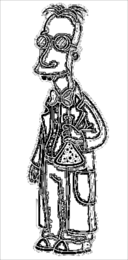

``` r

image_oilpaint(frink)
```


``` r

image_negate(frink)
```

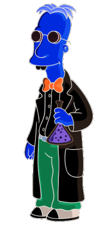

### Kernel convolution

The
[`image_convolve()`](https://docs.ropensci.org/magick/reference/morphology.md)
function applies a
[kernel](https://en.wikipedia.org/wiki/Kernel_(image_processing)) over
the image. Kernel convolution means that each pixel value is
recalculated using the weighted neighborhood sum defined in the kernel
matrix. For example lets look at this simple kernel:

``` r

kern <- matrix(0, ncol = 3, nrow = 3)
kern[1, 2] <- 0.25
kern[2, c(1, 3)] <- 0.25
kern[3, 2] <- 0.25
kern
```

    ##      [,1] [,2] [,3]
    ## [1,] 0.00 0.25 0.00
    ## [2,] 0.25 0.00 0.25
    ## [3,] 0.00 0.25 0.00

This kernel changes each pixel to the mean of its horizontal and
vertical neighboring pixels, which results in a slight blurring effect
in the right-hand image below:

``` r

img <- image_resize(logo, "300x300")
img_blurred <- image_convolve(img, kern)
image_append(c(img, img_blurred))
```


Or use any of the [standard
kernels](https://legacy.imagemagick.org/Usage/convolve/)

``` r

img |> image_convolve('Sobel') |> image_negate()
```


``` r

img |> image_convolve('DoG:0,0,2') |> image_negate()
```


### Text annotation

Finally it can be useful to print some text on top of images:

``` r

# Add some text
image_annotate(frink, "I like R!", size = 70, gravity = "southwest", color = "green")
```


``` r

# Customize text
image_annotate(frink, "CONFIDENTIAL", size = 30, color = "red", boxcolor = "pink",
  degrees = 60, location = "+50+100")
```


``` r

# Fonts may require ImageMagick has fontconfig
image_annotate(frink, "The quick brown fox", font = 'Times', size = 30)
```


Fonts that are supported on most platforms include `"sans"`, `"mono"`,
`"serif"`, `"Times"`, `"Helvetica"`, `"Trebuchet"`, `"Georgia"`,
`"Palatino"`or `"Comic Sans"`.

### Combining with pipes

Each of the image transformation functions returns a **modified copy**
of the original image. It does not affect the original image.

``` r

frink <- image_read("https://jeroen.github.io/images/frink.png")
frink2 <- image_scale(frink, "100")
image_info(frink)
```

    ##   format width height colorspace matte filesize density
    ## 1    PNG   220    445       sRGB  TRUE    73494   72x72

``` r

image_info(frink2)
```

    ##   format width height colorspace matte filesize density
    ## 1    PNG   100    202       sRGB  TRUE        0   72x72

Hence to combine transformations you need to chain them:

``` r

test <- image_rotate(frink, 90)
test <- image_background(test, "blue", flatten = TRUE)
test <- image_border(test, "red", "10x10")
test <- image_annotate(test, "This is how we combine transformations", color = "white", size = 30)
print(test)
```

    ##   format width height colorspace matte filesize density
    ## 1    PNG   465    240       sRGB  TRUE        0   72x72

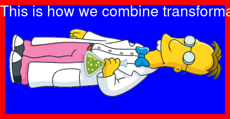

Using pipe syntax makes it a bit more readable

``` r

image_read("https://jeroen.github.io/images/frink.png") |>
  image_rotate(270) |>
  image_background("blue", flatten = TRUE) |>
  image_border("red", "10x10") |>
  image_annotate("The same thing with pipes", color = "white", size = 30)
```

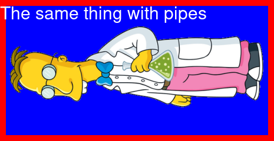

## Image Vectors

The examples above concern single images. However all functions in
magick have been vectorized to support working with layers, compositions
or animation.

The standard base methods `[` `[[`,
[`c()`](https://rdrr.io/r/base/c.html) and
[`length()`](https://rdrr.io/r/base/length.html) are used to manipulate
vectors of images which can then be treated as layers or frames.

``` r

# Download earth gif and make it a bit smaller for vignette
earth <- image_read("https://jeroen.github.io/images/earth.gif") |>
  image_scale("200x") |>
  image_quantize(128)

length(earth)
```

    ## [1] 44

``` r

earth
```

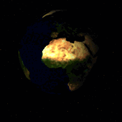

``` r

head(image_info(earth))
```

    ##   format width height colorspace matte filesize density
    ## 1    GIF   200    200        RGB FALSE        0   72x72
    ## 2    GIF   200    200        RGB  TRUE        0   72x72
    ## 3    GIF   200    200        RGB  TRUE        0   72x72
    ## 4    GIF   200    200        RGB  TRUE        0   72x72
    ## 5    GIF   200    200        RGB  TRUE        0   72x72
    ## 6    GIF   200    200        RGB  TRUE        0   72x72

``` r

rev(earth) |> 
  image_flip() |> 
  image_annotate("meanwhile in Australia", size = 20, color = "white")
```

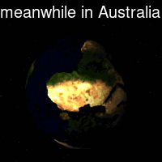

### Layers

We can stack layers on top of each other as we would in Photoshop:

``` r

bigdata <- image_read('https://jeroen.github.io/images/bigdata.jpg')
frink <- image_read("https://jeroen.github.io/images/frink.png")
logo <- image_read("https://jeroen.github.io/images/Rlogo.png")
img <- c(bigdata, logo, frink)
img <- image_scale(img, "300x300")
image_info(img)
```

    ##   format width height colorspace matte filesize density
    ## 1   JPEG   300    225       sRGB FALSE        0   72x72
    ## 2    PNG   300    232       sRGB  TRUE        0   72x72
    ## 3    PNG   148    300       sRGB  TRUE        0   72x72

A mosaic prints images on top of one another, expanding the output
canvas such that that everything fits:

``` r

image_mosaic(img)
```


Flattening combines the layers into a single image which has the size of
the first image:

``` r

image_flatten(img)
```


Flattening and mosaic allow for specifying alternative [composite
operators](https://imagemagick.org/Magick++/Enumerations.html):

``` r

image_flatten(img, 'Add')
```

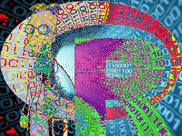

``` r

image_flatten(img, 'Modulate')
```


``` r

image_flatten(img, 'Minus')
```


### Combining

Appending means simply putting the frames next to each other:

``` r

image_append(image_scale(img, "x200"))
```


Use `stack = TRUE` to position them on top of each other:

``` r

image_append(image_scale(img, "100"), stack = TRUE)
```


Composing allows for combining two images on a specific position:

``` r

bigdatafrink <- image_scale(image_rotate(image_background(frink, "none"), 300), "x200")
image_composite(image_scale(bigdata, "x400"), bigdatafrink, offset = "+180+100")
```

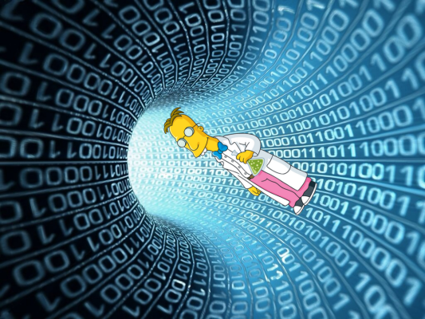

### Pages

When reading a PDF document, each page becomes an element of the vector.
Note that PDF gets rendered while reading so you need to specify the
density immediately.

``` r

manual <- image_read_pdf('https://cloud.r-project.org/web/packages/magick/magick.pdf', density = 72)
image_info(manual)
```

    ##    format width height colorspace matte filesize density
    ## 1     PNG   612    792       sRGB  TRUE        0   72x72
    ## 2     PNG   612    792       sRGB  TRUE        0   72x72
    ## 3     PNG   612    792       sRGB  TRUE        0   72x72
    ## 4     PNG   612    792       sRGB  TRUE        0   72x72
    ## 5     PNG   612    792       sRGB  TRUE        0   72x72
    ## 6     PNG   612    792       sRGB  TRUE        0   72x72
    ## 7     PNG   612    792       sRGB  TRUE        0   72x72
    ## 8     PNG   612    792       sRGB  TRUE        0   72x72
    ## 9     PNG   612    792       sRGB  TRUE        0   72x72
    ## 10    PNG   612    792       sRGB  TRUE        0   72x72
    ## 11    PNG   612    792       sRGB  TRUE        0   72x72
    ## 12    PNG   612    792       sRGB  TRUE        0   72x72
    ## 13    PNG   612    792       sRGB  TRUE        0   72x72
    ## 14    PNG   612    792       sRGB  TRUE        0   72x72
    ## 15    PNG   612    792       sRGB  TRUE        0   72x72
    ## 16    PNG   612    792       sRGB  TRUE        0   72x72
    ## 17    PNG   612    792       sRGB  TRUE        0   72x72
    ## 18    PNG   612    792       sRGB  TRUE        0   72x72
    ## 19    PNG   612    792       sRGB  TRUE        0   72x72
    ## 20    PNG   612    792       sRGB  TRUE        0   72x72
    ## 21    PNG   612    792       sRGB  TRUE        0   72x72
    ## 22    PNG   612    792       sRGB  TRUE        0   72x72
    ## 23    PNG   612    792       sRGB  TRUE        0   72x72
    ## 24    PNG   612    792       sRGB  TRUE        0   72x72
    ## 25    PNG   612    792       sRGB  TRUE        0   72x72
    ## 26    PNG   612    792       sRGB  TRUE        0   72x72
    ## 27    PNG   612    792       sRGB  TRUE        0   72x72
    ## 28    PNG   612    792       sRGB  TRUE        0   72x72
    ## 29    PNG   612    792       sRGB  TRUE        0   72x72
    ## 30    PNG   612    792       sRGB  TRUE        0   72x72
    ## 31    PNG   612    792       sRGB  TRUE        0   72x72
    ## 32    PNG   612    792       sRGB  TRUE        0   72x72
    ## 33    PNG   612    792       sRGB  TRUE        0   72x72
    ## 34    PNG   612    792       sRGB  TRUE        0   72x72
    ## 35    PNG   612    792       sRGB  TRUE        0   72x72
    ## 36    PNG   612    792       sRGB  TRUE        0   72x72
    ## 37    PNG   612    792       sRGB  TRUE        0   72x72
    ## 38    PNG   612    792       sRGB  TRUE        0   72x72
    ## 39    PNG   612    792       sRGB  TRUE        0   72x72
    ## 40    PNG   612    792       sRGB  TRUE        0   72x72
    ## 41    PNG   612    792       sRGB  TRUE        0   72x72
    ## 42    PNG   612    792       sRGB  TRUE        0   72x72
    ## 43    PNG   612    792       sRGB  TRUE        0   72x72
    ## 44    PNG   612    792       sRGB  TRUE        0   72x72
    ## 45    PNG   612    792       sRGB  TRUE        0   72x72

``` r

manual[1]
```

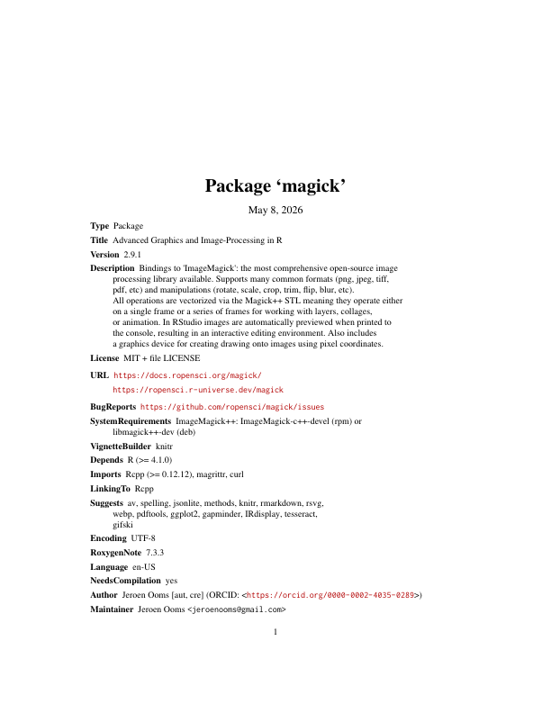

### Animation

Instead of treating vector elements as layers, we can also make them
frames in an animation!

``` r

image_animate(image_scale(img, "200x200"), fps = 1, dispose = "previous")
```


Morphing creates a sequence of `n` images that gradually morph one image
into another. It makes animations

``` r

newlogo <- image_scale(image_read("https://jeroen.github.io/images/Rlogo.png"))
oldlogo <- image_scale(image_read("https://jeroen.github.io/images/Rlogo-old.png"))
image_resize(c(oldlogo, newlogo), '200x150!') |>
  image_background('white') |>
  image_morph() |>
  image_animate(optimize = TRUE)
```


If you read in an existing GIF or Video file, each frame becomes a
layer:

``` r

# Foreground image
banana <- image_read("https://jeroen.github.io/images/banana.gif")
banana <- image_scale(banana, "150")
image_info(banana)
```

    ##   format width height colorspace matte filesize density
    ## 1    GIF   150    148       sRGB  TRUE        0   72x72
    ## 2    GIF   150    148       sRGB  TRUE        0   72x72
    ## 3    GIF   150    148       sRGB  TRUE        0   72x72
    ## 4    GIF   150    148       sRGB  TRUE        0   72x72
    ## 5    GIF   150    148       sRGB  TRUE        0   72x72
    ## 6    GIF   150    148       sRGB  TRUE        0   72x72
    ## 7    GIF   150    148       sRGB  TRUE        0   72x72
    ## 8    GIF   150    148       sRGB  TRUE        0   72x72

Manipulate the individual frames and put them back into an animation:

``` r

# Background image
background <- image_background(image_scale(logo, "200"), "white", flatten = TRUE)

# Combine and flatten frames
frames <- image_composite(background, banana, offset = "+70+30")

# Turn frames into animation
animation <- image_animate(frames, fps = 10, optimize = TRUE)
print(animation)
```

    ##   format width height colorspace matte filesize density
    ## 1    gif   200    155       sRGB  TRUE        0   72x72
    ## 2    gif    94    105       sRGB  TRUE        0   72x72
    ## 3    gif   125    122       sRGB  TRUE        0   72x72
    ## 4    gif   108    118       sRGB  TRUE        0   72x72
    ## 5    gif   108    105       sRGB  TRUE        0   72x72
    ## 6    gif    92    105       sRGB  TRUE        0   72x72
    ## 7    gif   113    123       sRGB  TRUE        0   72x72
    ## 8    gif   119    118       sRGB  TRUE        0   72x72


Animations can be saved as GIF of MPEG files:

``` r

image_write(animation, "Rlogo-banana.gif")
```

## Drawing and Graphics

A relatively recent addition to the package is a native R graphics
device which produces a magick image object. This can either be used
like a regular device for making plots, or alternatively to open a
device which draws onto an existing image using pixel coordinates.

### Graphics device

The
[`image_graph()`](https://docs.ropensci.org/magick/reference/device.md)
function opens a new graphics device similar to
e.g. [`png()`](https://rdrr.io/r/grDevices/png.html) or
[`x11()`](https://rdrr.io/r/grDevices/x11.html). It returns an image
object to which the plot(s) will be written. Each “page” in the plotting
device will become a frame in the image object.

``` r

# Produce image using graphics device
fig <- image_graph(width = 400, height = 400, res = 96)
ggplot2::qplot(mpg, wt, data = mtcars, colour = cyl)
```

    ## Warning: `qplot()` was deprecated in ggplot2 3.4.0.
    ## This warning is displayed once per session.
    ## Call `lifecycle::last_lifecycle_warnings()` to see where this warning was
    ## generated.

``` r

dev.off()
```

We can easily post-process the figure using regular image operations.

``` r

# Combine
out <- image_composite(fig, frink, offset = "+70+30")
print(out)
```

    ## # A data frame: 1 × 7
    ##   format width height colorspace matte filesize density
    ##   <chr>  <int>  <int> <chr>      <lgl>    <int> <chr>  
    ## 1 PNG      400    400 sRGB       TRUE         0 96x96

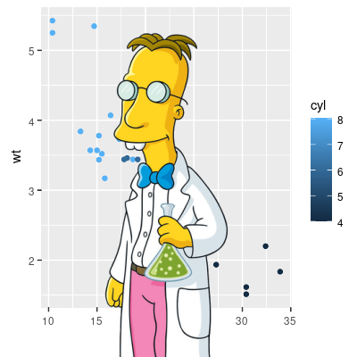

### Drawing device

Another way to use the graphics device is to draw on top of an exiting
image using pixel coordinates.

``` r

# Or paint over an existing image
img <- image_draw(frink)
rect(20, 20, 200, 100, border = "red", lty = "dashed", lwd = 5)
abline(h = 300, col = 'blue', lwd = '10', lty = "dotted")
text(30, 250, "Hoiven-Glaven", family = "monospace", cex = 4, srt = 90)
palette(rainbow(11, end = 0.9))
symbols(rep(200, 11), seq(0, 400, 40), circles = runif(11, 5, 35),
  bg = 1:11, inches = FALSE, add = TRUE)
dev.off()
```

``` r

print(img)
```

    ## # A data frame: 1 × 7
    ##   format width height colorspace matte filesize density
    ##   <chr>  <int>  <int> <chr>      <lgl>    <int> <chr>  
    ## 1 PNG      220    445 sRGB       TRUE         0 72x72


By default
[`image_draw()`](https://docs.ropensci.org/magick/reference/device.md)
sets all margins to 0 and uses graphics coordinates to match image size
in pixels (width x height) where (0,0) is the top left corner. Note that
this means the y axis increases from top to bottom which is the opposite
of typical graphics coordinates. You can override all this by passing
custom `xlim`, `ylim` or `mar` values to `image_draw`.

### Animated Graphics

The graphics device supports multiple frames which makes it easy to
create animated graphics. The code below shows how you would implement
the example from the very cool [gganimate](https://gganimate.com/)
package using the magick graphics device.

``` r

library(gapminder)
library(ggplot2)
img <- image_graph(600, 340, res = 96)
datalist <- split(gapminder, gapminder$year)
out <- lapply(datalist, function(data){
  p <- ggplot(data, aes(gdpPercap, lifeExp, size = pop, color = continent)) +
    scale_size("population", limits = range(gapminder$pop)) + geom_point() + ylim(20, 90) + 
    scale_x_log10(limits = range(gapminder$gdpPercap)) + ggtitle(data$year) + theme_classic()
  print(p)
})
dev.off()
animation <- image_animate(img, fps = 2, optimize = TRUE)
print(animation)
```

    ## # A tibble: 12 × 7
    ##    format width height colorspace matte filesize density
    ##    <chr>  <int>  <int> <chr>      <lgl>    <int> <chr>  
    ##  1 gif      600    340 sRGB       TRUE         0 96x96  
    ##  2 gif      382    236 sRGB       TRUE         0 96x96  
    ##  3 gif      392    231 sRGB       TRUE         0 96x96  
    ##  4 gif      371    226 sRGB       TRUE         0 96x96  
    ##  5 gif      390    220 sRGB       TRUE         0 96x96  
    ##  6 gif      371    229 sRGB       TRUE         0 96x96  
    ##  7 gif      351    229 sRGB       TRUE         0 96x96  
    ##  8 gif      306    205 sRGB       TRUE         0 96x96  
    ##  9 gif      318    253 sRGB       TRUE         0 96x96  
    ## 10 gif      328    213 sRGB       TRUE         0 96x96  
    ## 11 gif      353    203 sRGB       TRUE         0 96x96  
    ## 12 gif      345    203 sRGB       TRUE         0 96x96

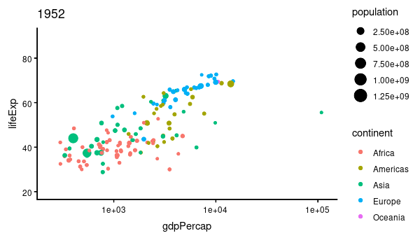

To write it to a file you would simply do:

``` r

image_write(animation, "gapminder.gif")
```

## Raster Images

Magick images can also be converted to raster objects for use with R’s
graphics device. Thereby we can combine it with other graphics tools.
However do note that R’s graphics device is very slow and has a very
different coordinate system which reduces the quality of the image.

### Base R rasters

Base R has an `as.raster` format which converts the image to a vector of
strings. The paper [Raster Images in R
Graphics](https://journal.r-project.org/articles/RJ-2011-008/) by Paul
Murrell gives a nice overview.

``` r

plot(as.raster(frink))
```


``` r

# Print over another graphic
plot(cars)
rasterImage(frink, 21, 0, 25, 80)
```


### The `grid` package

The `grid` package makes it easier to overlay a raster on the graphics
device without having to adjust for the x/y coordinates of the plot.

``` r

library(ggplot2)
library(grid)
qplot(speed, dist, data = cars, geom = c("point", "smooth"))
```

    ## `geom_smooth()` using method = 'loess' and formula = 'y ~ x'

``` r

grid.raster(frink)
```

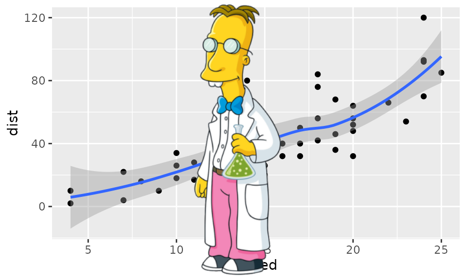

## OCR text extraction

A recent addition to the package is to extract text from images using
OCR. This requires the tesseract package:

``` r

install.packages("tesseract")
```

``` r

img <- image_read("https://jeroen.github.io/images/testocr.png")
print(img)
```

    ## # A tibble: 1 × 7
    ##   format width height colorspace matte filesize density
    ##   <chr>  <int>  <int> <chr>      <lgl>    <int> <chr>  
    ## 1 PNG      640    480 sRGB       TRUE     23359 72x72

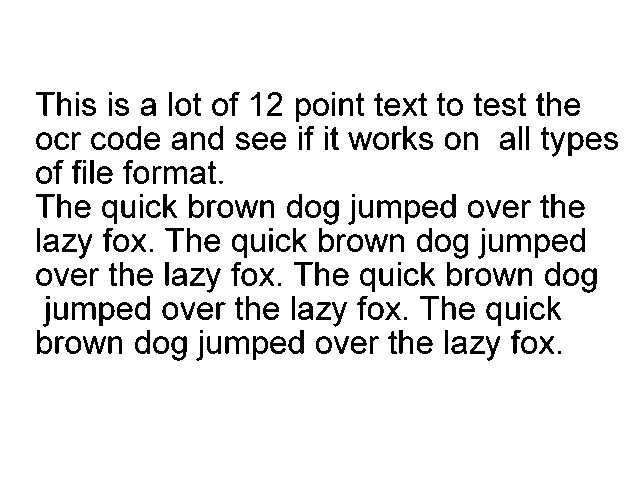

``` r

# Extract text
cat(image_ocr(img))
```

    ## This is a lot of 12 point text to test the
    ## ocr code and see if it works on all types
    ## of file format.
    ## 
    ## The quick brown dog jumped over the
    ## lazy fox. The quick brown dog jumped
    ## over the lazy fox. The quick brown dog
    ## jumped over the lazy fox. The quick
    ## brown dog jumped over the lazy fox.
